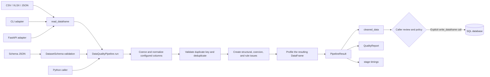

# Architecture and processing contract

## Processing contract

1. An adapter parses a supported CSV, XLSX, or JSON source into a Pandas DataFrame.
2. Pydantic validates the schema and rejects unknown fields, invalid regular expressions, contradictory case normalization, and invalid duplicate-key declarations.
3. The pipeline deep-copies the input so the caller’s frame is not modified.
4. Configured values are normalized and coerced. Invalid non-null values receive `coercion_failure`; original nulls receive `source_null` when nulls are prohibited.
5. Declared duplicate columns are checked against the incoming DataFrame before Pandas deduplication. Missing keys produce structured issues.
6. Required/extra columns, uniqueness, bounds, allowed values, and full-match regular expressions are evaluated.
7. The resulting DataFrame is profiled, and the pipeline returns normalized data, a structured report, and stage timings.
8. Persistence is a separate caller action. `DataQualityPipeline.run()` never writes to a database and does not automatically approve or reject a result for storage.

## Component boundaries

- `io.py`: file-format parsing and CSV serialization.
- `models.py`: public schema, issue, profile, and result contracts.
- `transformers.py`: deterministic value normalization and coercion.
- `validation.py`: data-rule issue generation.
- `profiling.py`: column summaries over the output DataFrame.
- `pipeline.py`: orchestration, duplicate handling, timings, and report assembly.
- `api.py`: upload controls, schema parsing, HTTP responses, and optional preview.
- `cli.py`: local file-to-file workflow.
- `database.py`: explicit append-only SQLAlchemy persistence.

The core is deterministic for a given DataFrame and schema. File parsing, HTTP behavior, and database side effects remain outside the core so they can be tested and governed independently.
